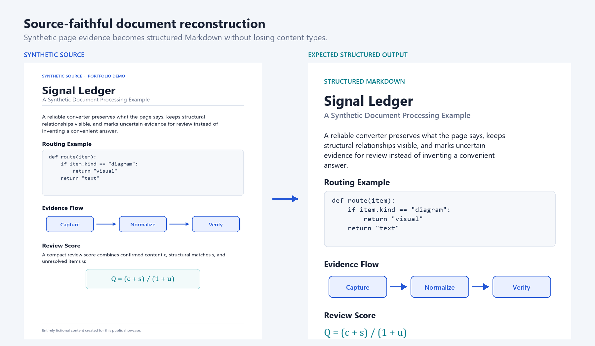
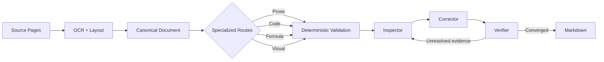
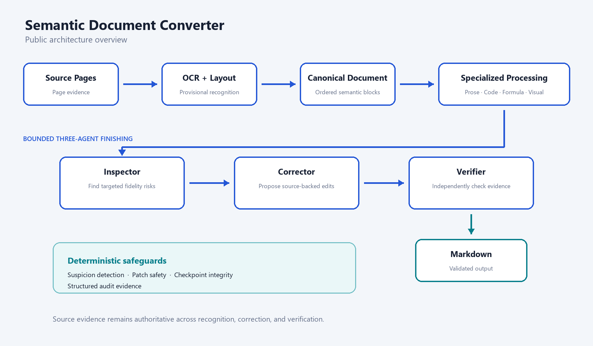

# Semantic Document Converter — Engineering Showcase

A source-faithful document conversion pipeline that turns page images into structured, audited Markdown through OCR, layout analysis, deterministic safeguards, and bounded AI verification.

This repository is a public engineering showcase. The production implementation remains private.



## Overview

Semantic Document Converter (SDC) addresses document reconstruction rather than plain text extraction:

```text
Source document → structured representation → audited Markdown
```

The pipeline preserves relationships that ordinary OCR often loses—headings, prose, code, formulas, diagrams, and reading order—while keeping the source page as the ground truth. This approach is relevant when clients need usable Markdown without silently replacing uncertain evidence with plausible-looking content.

## Part of the Semantic Processing Suite

SDC is the upstream document-reconstruction layer of the broader **Semantic Processing Suite**, a staged workflow that separates source reconstruction, knowledge extraction, and reusable logic generation.

```text
Source Document
      ↓
SDC — Semantic Document Converter
      ↓
Source-faithful Reader Markdown
      ↓
SKC — Semantic Knowledge Crystallizer
      ↓
*_knowledge
      ↓
SLC — Semantic Logic Compiler
      ↓
*_logic
```

SDC deliberately avoids summarization and semantic reinterpretation. SKC consumes its source-faithful Markdown to create `*_knowledge`, and SLC consumes that knowledge to create explicitly derived `*_logic`. Each component remains independently testable through a clear artifact boundary.

## The Problem

Real document pipelines fail in more ways than a single character-recognition score reveals. Common problems include:

- character corruption and abnormal repetition;
- damaged URLs, markup, and code indentation;
- lost layout and reading order;
- missing or flattened visual structure;
- confident but unsupported AI corrections; and
- interrupted long-running verification workflows.

The engineering challenge is to recover structure while making uncertainty visible and keeping every accepted correction within a source-backed boundary.

## What I Built

- An OCR and layout pipeline that normalizes page evidence into a canonical document before rendering Markdown.
- Specialized processing routes for prose, code, formulas, and visuals, so each content type receives an appropriate fidelity policy.
- Source-faithful reconstruction that avoids summarizing, stylistic rewriting, or inventing missing content.
- Formula OCR integration with a visual fallback when a reliable transcription is unavailable.
- Diagram handling that can preserve simple relationships as Mermaid while retaining complex visuals as images.
- Deterministic suspicion detection and patch validation around probabilistic model output.
- Independent Inspector, Corrector, and Verifier roles for bounded, evidence-driven finishing.
- Chunk-level checkpoints and structured audit evidence for recoverable long-running work.

Together, these capabilities support client work where accuracy, traceability, privacy, and operational recovery matter as much as extraction speed.

## Architecture





See [Architecture](docs/ARCHITECTURE.md) for the responsibility boundaries behind the pipeline.

## Engineering Highlights

- **Source fidelity first.** Source pages remain the authority; OCR and model responses are provisional evidence.
- **Deterministic + AI hybrid.** Code handles invariants and safety checks, while models focus on ambiguous, source-visible interpretation.
- **Safe correction boundaries.** Candidate edits must pass deterministic validation before they can affect the document.
- **Code-aware transcription.** Printed code is treated separately from prose so indentation, line breaks, and even intentional errors can be preserved.
- **Visual semantic preservation.** Diagrams are reconstructed only when their relationships can be retained; otherwise the source visual remains available.
- **Multi-agent convergence.** Inspection, correction, and verification have distinct roles instead of relying on one unrestricted rewrite pass.
- **Resume and auditability.** Completed chunks can be checkpointed, and finishing decisions can be recorded as structured evidence.

## Synthetic Demo

The [synthetic demo](demo/README.md) shows a fictional page containing prose, code, a small diagram, and a formula, followed by its expected structured Markdown. All material was created for this repository.

- [Synthetic source page](demo/synthetic_source.png)
- [Illustrative expected output](demo/synthetic_output.md)

## Representative Code

> Representative simplified examples.
> Production implementation remains private.

- [Suspicion detection](snippets/suspicion_detection.py) — flags evidence that should be checked without modifying it.
- [Source-faithful patch guard](snippets/source_faithful_patch_guard.py) — accepts or rejects a proposed local edit through deterministic rules.
- [Resumable finishing](snippets/resumable_finishing.py) — skips completed chunks after a safe restart.

These examples were written specifically for this portfolio and are not copies of the production implementation.

## Quality Engineering

The private SDC v0.2.0 build combines unit testing, small real-document smoke tests, and failure-driven release qualification. For this showcase review, its unit suite was re-run locally: **164 tests passed**. Its current repository status is **active development / release qualification**: RQ-0 through RQ-3 are recorded as passed, while RQ-4 remains on hold. The build is not release-locked and is currently undergoing large-document release qualification.

The qualification strategy emphasizes general failure classes—such as corrupted repetition, unsafe corrections, visual omissions, verifier overreach, and interrupted processing—rather than document-specific exceptions.

## Skills Demonstrated

- Python and CLI application design
- OCR and document-processing pipelines
- computer-vision and local VLM integration
- local LLM integration and structured outputs
- canonical data modeling
- deterministic validation
- reliability engineering and resumable workflows
- AI agent orchestration
- source-grounded testing and audit design

## Client Relevance

Relevant project types include:

- OCR automation and document extraction;
- AI-assisted document processing;
- local or private AI workflows;
- structured data validation;
- recoverable batch processing; and
- agentic workflow engineering.

For a concise account of the engineering decisions, see the [Engineering Case Study](docs/ENGINEERING_CASE_STUDY.md).

## Related Projects

- [Semantic Knowledge Pipeline](https://github.com/SUZUKITAKAYUKISUZUKI/semantic-knowledge-pipeline-showcase) — downstream knowledge crystallization and logic compilation using SKC and SLC.

## Repository Scope

- This repository is a portfolio showcase, not an OSS distribution of SDC.
- The production code and internal design material remain private.
- Code under `snippets/` consists of simplified representative examples.
- All demo text and imagery are synthetic.
- No copyrighted source-book content is included.
- No software license is granted or implied by this repository.

See [NOTICE.md](NOTICE.md) for the public/private boundary.
