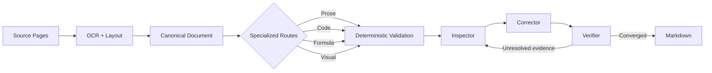

# Semantic Document Converter — Engineering Showcase

A Python-based document automation pipeline for turning scanned pages and PDF-derived page images into structured, source-faithful Markdown with OCR, layout analysis, and bounded AI verification.

[日本語版 / Japanese Portfolio](README_JA.md)

This repository is a public engineering showcase. The production implementation remains private.

## What This Can Help With

- OCR automation for scanned documents and PDF-derived page images
- document-to-Markdown conversion that retains headings, prose, code, formulas, diagrams, and reading order
- structured document extraction for downstream search, review, or data workflows
- local or private AI-assisted document processing
- deterministic validation around uncertain OCR and model output
- recoverable long-running batch processing with checkpoints and audit evidence

## Quick Demo


The [synthetic demo](demo/README.md) shows a fictional page containing prose, code, a small diagram, and a formula, followed by its expected structured Markdown.

- [Synthetic source page](demo/synthetic_source.png)
- [Illustrative expected output](demo/synthetic_output.md)

This is an illustrative expected transformation, not output claimed from a production run. All demo material was created for this repository.

## The Problem

Plain OCR can produce readable text while still damaging the structure and evidence that make a document useful. Common failures include:

- character corruption and abnormal repetition;
- damaged URLs, markup, and code indentation;
- lost layout and reading order;
- missing or flattened visual structure;
- confident but unsupported AI corrections; and
- interrupted long-running verification workflows.

The engineering challenge is to recover structure while making uncertainty visible and keeping every accepted correction within a source-backed boundary.

## What I Built

- An OCR and layout pipeline that normalizes page evidence into a canonical document before rendering Markdown.
- Specialized processing routes for prose, code, formulas, and visuals, so each content type receives an appropriate fidelity policy.
- Source-faithful reconstruction that avoids summarizing, stylistic rewriting, or inventing missing content.
- Formula OCR integration with a visual fallback when a reliable transcription is unavailable.
- Diagram handling that can preserve simple relationships as Mermaid while retaining complex visuals as images.
- Deterministic suspicion detection and patch validation around probabilistic model output.
- Independent Inspector, Corrector, and Verifier roles for bounded, evidence-driven finishing.
- Chunk-level checkpoints and structured audit evidence for recoverable long-running work.

Together, these capabilities support client work where accuracy, traceability, privacy, and operational recovery matter as much as extraction speed.

## How It Works

SDC addresses document reconstruction rather than plain text extraction:

```text
Source pages → canonical document → specialized processing → validated Markdown
```

The source page remains the ground truth. OCR and layout analysis identify candidate content and reading order; a canonical representation keeps ordered semantic blocks and source associations; specialized routes apply different fidelity rules to prose, code, formulas, and visuals; deterministic controls then bound AI-assisted inspection and correction.




See [Architecture](docs/ARCHITECTURE.md) for the responsibility boundaries behind the pipeline.

## Engineering Highlights

- **Source fidelity first.** Source pages remain the authority; OCR and model responses are provisional evidence.
- **Deterministic + AI hybrid.** Code handles invariants and safety checks, while models focus on ambiguous, source-visible interpretation.
- **Safe correction boundaries.** Candidate edits must pass deterministic validation before they can affect the document.
- **Code-aware transcription.** Printed code is treated separately from prose so indentation, line breaks, and even intentional errors can be preserved.
- **Visual semantic preservation.** Diagrams are reconstructed only when their relationships can be retained; otherwise the source visual remains available.
- **Multi-agent convergence.** Inspection, correction, and verification have distinct roles instead of relying on one unrestricted rewrite pass.
- **Resume and auditability.** Completed chunks can be checkpointed, and finishing decisions can be recorded as structured evidence.

## Quality and Current Status

**Status:** Active development / Release Qualification

**Private build version:** `v0.2.0`

**Release state:** Not release-locked

The private repository records RQ-0 through RQ-3 as passed and RQ-4 as on hold while large-document qualification remains open. Its quality process combines automated unit tests, small real-document smoke tests, and failure-driven qualification.

Qualification focuses on general failure classes—such as corrupted repetition, unsafe corrections, visual omissions, verifier overreach, and interrupted processing—rather than document-specific exceptions.

## Representative Code

> Representative simplified examples.
>
> Production implementation remains private.

- [Suspicion detection](snippets/suspicion_detection.py) — flags evidence that should be checked without modifying it.
- [Source-faithful patch guard](snippets/source_faithful_patch_guard.py) — accepts or rejects a proposed local edit through deterministic rules.
- [Resumable finishing](snippets/resumable_finishing.py) — skips completed chunks after a safe restart.

These examples were written specifically for this portfolio and are not copies of the production implementation.

## Engineering Case Study

The [Engineering Case Study](docs/ENGINEERING_CASE_STUDY.md) explains the observed failure modes and the design responses: deterministic suspicion escalation, source-crop verification, prose micro-patching, code-specific policies, visual audits, independent verification, and resumable processing.

## Skills Demonstrated

- Python and CLI application design
- OCR and document-processing pipelines
- computer-vision and local VLM integration
- local LLM integration and structured outputs
- canonical data modeling
- deterministic validation
- reliability engineering and resumable workflows
- AI agent orchestration
- source-grounded testing and audit design

## Relevant Project Types

- OCR automation and document extraction
- PDF- or image-based document processing
- document-to-Markdown and structured-data conversion
- AI-assisted document review
- local or private AI workflows
- structured data validation
- recoverable batch processing
- agentic workflow engineering

## Part of the Semantic Processing Suite

SDC is the upstream document-reconstruction layer of a staged workflow that separates source reconstruction, knowledge extraction, and reusable logic generation.

```text
Source Document
      ↓
SDC — Semantic Document Converter
      ↓
Source-faithful Reader Markdown
      ↓
SKC — Semantic Knowledge Crystallizer
      ↓
*_knowledge
      ↓
SLC — Semantic Logic Compiler
      ↓
*_logic
```

SDC deliberately avoids summarization and semantic reinterpretation. SKC consumes its source-faithful Markdown to create `*_knowledge`, and SLC processes logic-capable knowledge into explicitly derived `*_logic`. Each component remains independently testable through a clear artifact boundary.

## Repository Scope

- This repository is a portfolio showcase, not an OSS distribution of SDC.
- The production code and internal design material remain private.
- Code under `snippets/` consists of simplified representative examples.
- All demo text and imagery are synthetic.
- No copyrighted source-book content is included.
- No software license is granted or implied by this repository.

See [NOTICE.md](NOTICE.md) for the public/private boundary.

## Related Projects

- [Semantic Knowledge Pipeline](https://github.com/SUZUKITAKAYUKISUZUKI/semantic-knowledge-pipeline-showcase) — downstream knowledge crystallization and logic compilation using SKC and SLC.
