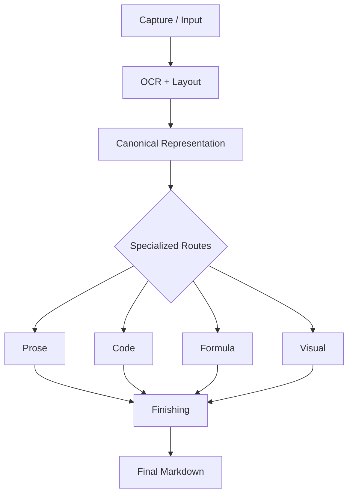
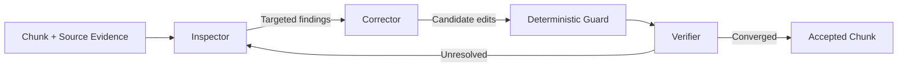

# Architecture

## Design Goal

The core design goal is **Source Fidelity First**: reconstruct the document that is visible in the source, not a cleaner or more plausible document invented by the pipeline.

OCR, visual models, and language models can all provide useful evidence, but none of them is treated as unquestioned truth. The architecture combines their strengths with deterministic controls and explicit failure states.

## Pipeline

The source is captured as ordered page evidence. OCR and layout analysis identify candidate content and reading order. A canonical representation holds semantic blocks, provenance, and source associations. Specialized routes then preserve the constraints of each content type before finishing and deterministic rendering.

## Canonical Representation

The pipeline does not repeatedly rewrite a growing Markdown string. Instead, it works with a compact document model made of ordered semantic blocks.

At a public conceptual level, each block records:

- a stable identity and document position;
- a content type such as prose, code, formula, or visual;
- provisional recognized content;
- source evidence or an asset reference; and
- provenance describing how the content was obtained.

Markdown is rendered from this representation after validation. This separation makes structural errors easier to detect and prevents formatting details from becoming the hidden source of truth.

## Specialized Routes

### Prose

Prose allows only narrow, source-supported corrections. The system avoids paraphrasing, tone changes, and broad replacement of uncertain text.

### Code

Code is transcribed under a different policy. Visible characters, indentation, line breaks, blank lines, and intentional errors matter more than producing code that compiles.

### Formula

Formula candidates can use a dedicated formula recognizer. A transcription remains provisional until checked; an unreadable formula is preserved visually instead of being guessed.

### Visual

Simple structural diagrams may become Mermaid when nodes, labels, and relationships can be preserved. Complex figures remain image evidence with a restrained description rather than an invented reconstruction.

## Deterministic vs AI Responsibilities

| Deterministic code | AI-assisted reasoning |
| --- | --- |
| Validate document invariants | Interpret ambiguous visual evidence |
| Detect suspicious text patterns | Compare candidate text with the source |
| Enforce patch safety | Propose localized corrections |
| Verify checkpoint integrity | Independently verify targeted changes |
| Render validated structure | Mark uncertainty as unresolved |

This boundary keeps probabilistic output inside a controlled process. AI can propose an answer, but deterministic code decides whether the proposal satisfies the allowed shape and safety conditions.

## Three-Agent Finishing

- **Inspector:** identifies likely source-fidelity problems and defines a bounded review scope.
- **Corrector:** proposes only localized, source-supported changes for that scope.
- **Verifier:** independently checks the targeted evidence and accepted candidate state.

These are different responsibilities, not three votes on the same free-form response. Unresolved evidence blocks convergence rather than being silently accepted.

## Resume

Finishing operates on stable chunks. A chunk is checkpointed only after it reaches the required completion state. After an interruption, the workflow can verify the checkpoint, skip completed chunks, and resume at the first incomplete unit.

This reduces repeated model work while preventing partially reviewed content from being mistaken for completed work.

## Auditability

Structured audit records can capture findings, suspicion categories, correction proposals, validation decisions, verification results, and chunk outcomes. They provide evidence about what the system did without persisting hidden model reasoning.

The public showcase intentionally omits private schemas, prompts, thresholds, and operational traces.
